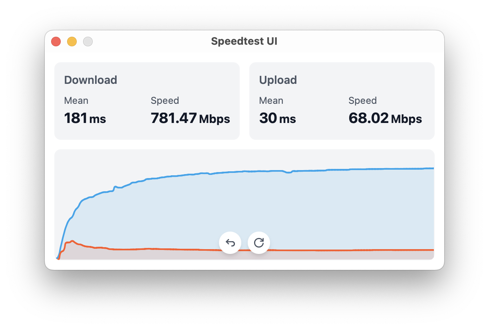

# Speedtest UI



---

A modern and elegant speedtest tool built with Tauri and React, based on Speedtest® CLI.

> [!IMPORTANT]
> This software is for learning and research purposes only. Commercial use is strictly prohibited.

## Features

- 🚀 Fast and lightweight
- 🎨 Beautiful UI with dark mode support
- 📊 Real-time speed charts
- 🔄 Support for both Mbps and MB/s units
- 🌐 Cross-platform support for macOS, Windows, and Linux

## Download

Please check the [releases page](https://github.com/zhangyu1818/speedtest-ui/releases).

## Note

### MacOS

**The application is damaged**

Since there is no Apple developer account and the application is unsigned. To solve this, please run the following command and then reopen.

```bash
xattr -cr /Applications/Speedtest\ UI.app/
```

### Linux

Runs normally on Arch. To install on Arch, run the following command.

```bash
yay -S speedtest-ui-bin
```

### Windows

Runs normally except that a command line window pops up.

## Development

### Prerequisites

- Node.js (v18 or higher)
- Rust (latest stable)
- Tauri setup requirements ([see here](https://v2.tauri.app/start/prerequisites/))

### Installation

1. Clone the repository

   ```bash
   git clone https://github.com/zhangyu1818/speedtest-ui.git
   cd speedtest-ui
   ```

2. Install dependencies

   ```bash
   pnpm install
   ```

3. Run development server

   ```bash
   pnpm tauri dev
   ```

### Building

To create a production build:

```bash
pnpm tauri build
```
